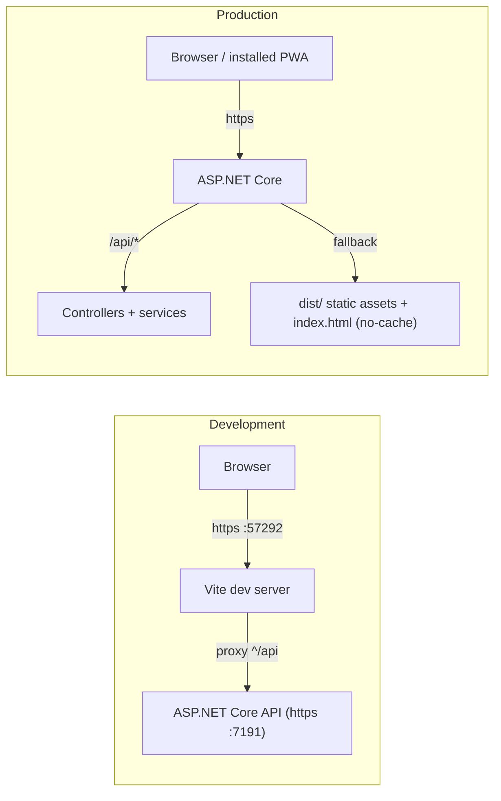

# .NET 10 + Vue 3 SPA Template

[](https://github.com/monotio/spa-vue-template/actions/workflows/ci.yml)
[](https://github.com/monotio/spa-vue-template/actions/workflows/codeql.yml)
[](https://scorecard.dev/viewer/?uri=github.com/monotio/spa-vue-template)
[](LICENSE)

Golden boilerplate for a modern full-stack SPA/PWA: **Vue 3 + TypeScript 6 +
Vite 8 (Rolldown)** frontend, **ASP.NET Core (.NET 10, C# 14)** backend, with
strict quality gates, supply-chain hardening, and first-class support for
agentic development — so you can start building features in minutes, not days.

## Getting started

1. **Use this template** (button above) → the first push runs
   `template-cleanup.yml`, which renames everything from `VueApp1` to your
   repo's name and deletes the rename machinery.
2. **Or clone manually** → `node scripts/rename.mjs MyApp --apply`
   (dry-run without `--apply`), then delete the script.
3. Install the toolchain (.NET SDK from `global.json`, Node from `.nvmrc` —
   per-OS details in [SETUP.md](SETUP.md)), then:

```bash
npm run setup    # git hooks + npm ci + trusted rebuilds + locked NuGet restore
npm run check    # the full validation gate — should be green out of the box
npm run dev:server & npm run dev:client
```

Codespaces/devcontainer users: just create the codespace — `.devcontainer/`
provisions everything.

> After renaming: regenerate the PWA icons from your own logo
> (`public/logo.svg` → `npm run generate-pwa-assets`).

## What's included

| Area | What you get |
| --- | --- |
| Frontend | Vue 3.5 Composition API, TypeScript 6 strict (`strictImportMetaEnv` + friends), Pinia, Vue Router 5 (scroll + focus management), VueUse, ProblemDetails-aware composables (`useFetch`, dirty guard, downloads), ESLint 10 type-checked + Prettier, Vitest 4 with determinism pins (TZ, timeouts, storage shim) |
| PWA | vite-plugin-pwa: installable app shell, offline precache, update prompt, icon pipeline — with the service worker correctly denied from `/api` routes |
| Backend | Controllers + `ServiceResponse<T>` service layer, RFC 9457 ProblemDetails on every error (incl. unhandled exceptions with `traceId`), OpenAPI 3.1 + Scalar docs, output caching, rate limiting, HybridCache, request timeouts, options validated at boot, dormant background-queue + Idempotency-Key seams |
| Security | Security headers + CSP, exploit-probe denylist, Kestrel body/rate limits, host-header-safe link generation, compile-banned APIs (`BannedSymbols.txt`: no wall-clock reads, no sync-over-async), npm `ignore-scripts` + allow-list, NuGet lockfiles + source mapping + central package management |
| API contract | `docs/openapi/openapi.v1.json` **and** generated TS types (`src/contracts/api.gen.ts`) are committed; CI fails on drift (`npm run openapi:sync` to update); a transformer pack keeps documented error responses truthful (global 429, problem+json everywhere) |
| Ops | Multi-stage Dockerfile on a chiseled (non-root, shell-less) runtime with build-time Brotli, `/health/live` + `/health/ready` probes, container smoke test in CI, config-gated OpenTelemetry |
| CI/CD | SHA-pinned actions, CodeQL (C# + TS), OpenSSF Scorecard, dependency review, PR-title lint, build provenance attestations, tuned Dependabot (grouped minors, solo majors, cooldowns), Windows leg on main |
| Testing | xUnit v3 (unit + WebApplicationFactory integration), coverage gates, test wrappers with disk logs + signal-safe exits, anti-flake doctrine |
| Agentic dev | `AGENTS.md` playbook (Claude Code reads it via `CLAUDE.md`), committed `.claude/` settings/hooks/skills with a cross-runtime `.agents/` mirror, browser-verification skill, opt-in [MCP server](docs/MCP.md) over the existing service layer, opt-in ast-grep guardrails, one-command setup, zero-secret boot |
| Docs | Decision guides for [auth](docs/AUTH.md), [database](docs/DATA.md), [background work](docs/BACKGROUND.md), [styling](docs/STYLING.md), [realtime](docs/REALTIME.md); [LLM-feature discipline](docs/AI.md); deep dives for [testing](docs/TESTING.md), [frontend](docs/FRONTEND.md), [API](docs/API.md), [config](docs/CONFIG.md), [patterns](docs/PATTERNS.md), [MCP](docs/MCP.md) |

## Architecture



## Daily commands

```bash
npm run check          # THE gate: lint + format + types + FE tests + build + OpenAPI + BE tests
npm run check:fast     # parallelized iteration variant
npm run test           # all tests; filtered: npm run test:backend -- --filter "..."
npm run openapi:sync   # after API changes — commit the contract diff
npm run test:load      # local sustained-load smoke test
```

Full command/agent guidance: [AGENTS.md](AGENTS.md).

## Supply-chain notes you should know

- **npm install scripts are disabled** (root `.npmrc ignore-scripts=true`) —
  the dominant npm attack vector is off by default. The flip side: a new
  dependency that needs its postinstall must be added to the
  `rebuild-trusted` allow-list in `vueapp1.client/package.json` (and that's
  deliberately a visible, reviewable event). To opt out, delete `.npmrc`.
- **Build provenance**: artifacts built on main are attested; verify with
  `gh attestation verify <artifact> --repo <owner>/<repo>`.
- **Microsoft.OpenApi stays 2.x** — documented trap, enforced via Dependabot
  ignore + comments in `Directory.Packages.props`.

## Deliberate non-decisions

Lean by design — these ship as documentation (or at most a dormant seam),
not always-on code:

- **No database** → [docs/DATA.md](docs/DATA.md) maps EF Core into the
  existing seams (health checks, Server-Timing, OTel, Testcontainers).
- **No auth** → [docs/AUTH.md](docs/AUTH.md): cookies + Identity endpoints,
  BFF for external IdPs, .NET 10 passkeys.
- **No job scheduler** → [docs/BACKGROUND.md](docs/BACKGROUND.md): a tested
  in-process queue ships as a dormant seam (`BackgroundWork/`); the guide
  covers when it suffices vs Hangfire/Quartz, and the invariants any
  at-least-once scheduler inherits.
- **No i18n** → add vue-i18n when needed; prebuild locale chunks at build
  time rather than fetching translation JSON at runtime.
- **No CSS framework** → [docs/STYLING.md](docs/STYLING.md): why plain
  scoped CSS ships, with vetted Tailwind v4 / UnoCSS / component-library
  recipes for when you outgrow it.
- **No realtime transport** → [docs/REALTIME.md](docs/REALTIME.md): SSE vs
  SignalR vs WebSocket decision table; .NET 10 native SSE is the
  zero-dependency default.
- **No LLM plumbing** → [docs/AI.md](docs/AI.md): the prompt-discipline,
  injection-defence, and eval rules to adopt with your first AI feature.
- **No husky/lint-staged** → CI is the gate; the one git hook is pre-push
  branch protection. No `packageManager`/corepack (npm-only; corepack left
  Node ≥25).
- **Watch list** (re-evaluate quarterly): Vue Vapor Mode, Vitest 5, oxlint
  pre-pass, tsgo type-checking, xUnit v4, `dotnet new` template packaging —
  rationale in [docs/FRONTEND.md](docs/FRONTEND.md) and
  [docs/TESTING.md](docs/TESTING.md).

## License

MIT. Projects generated from this template may relicense freely — no
attribution required.
